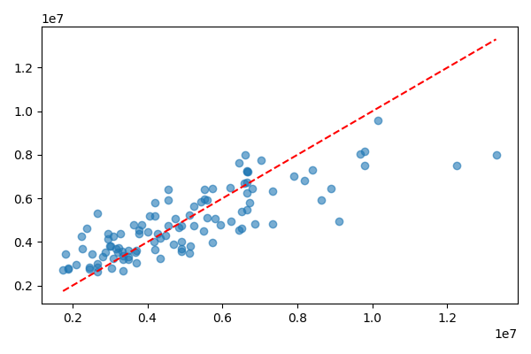
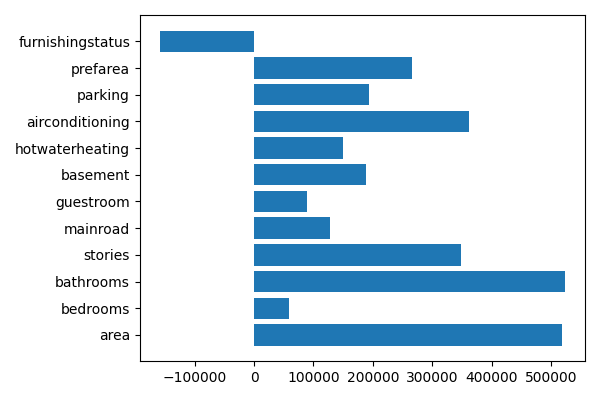
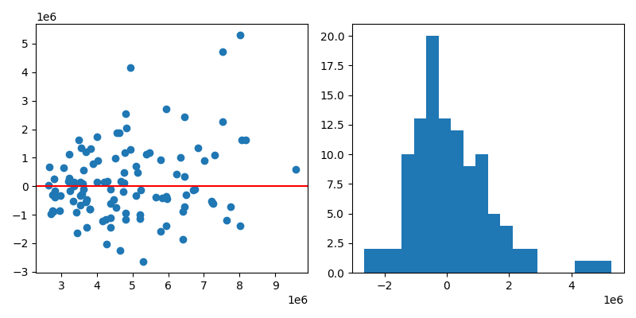
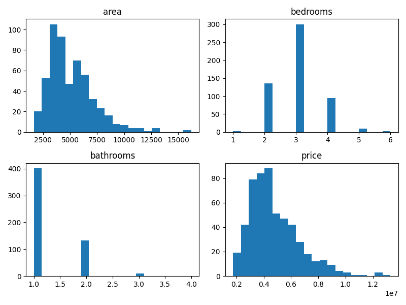

# Linear Regression Model for House Price Prediction

## Project Overview
This project implements a linear regression model to predict house prices based on property characteristics. It uses real housing data to train and evaluate the model's predictive capabilities.

## Objective
Build and train a linear regression model that can accurately predict house prices using features such as area, bedrooms, bathrooms, and other property attributes.

## Tech Stack
- Python 3.x
- pandas - Data manipulation and analysis
- scikit-learn - Machine learning library
- NumPy - Numerical computations
- matplotlib - Data visualization
- seaborn - Statistical data visualization

## Dataset

**Dataset Name:** Housing.csv  
**Total Records:** 545 houses  
**Features:** 12 (area, bedrooms, bathrooms, stories, mainroad, guestroom, basement, hotwaterheating, airconditioning, parking, prefarea, furnishingstatus)  
**Price Range:** PKR 1,750,000 - 13,300,000  
**Area Range:** 1,650 - 16,200 sqft  

**Location:** `data/Housing.csv`

The dataset contains real estate property information with various categorical and numerical features used to predict house prices in Pakistani rupees.

## Project Structure
```
├── README.md
├── requirements.txt
├── main.py                          # Simple house price prediction
├── main_housing.py                  # Real dataset analysis
├── data/
│   ├── housing_data.csv             # Sample dataset
│   └── Housing.csv                  # Real housing dataset (545 records)
├── src/
│   ├── __init__.py
│   ├── model.py                     # Model class
│   ├── data_preprocessing.py        # Data utilities
│   └── visualization.py             # Visualization functions
├── housing_model_results.txt        # Model results and metrics
├── MODEL_RESULTS.md                 # Detailed results
└── DETAILED_RESULTS.txt             # Complete analysis
```

## Installation

1. Clone the repository:
```bash
git clone https://github.com/ksk-22/PRODIGY_ML_01.git
cd PRODIGY_ML_01
```

2. Install required dependencies:
```bash
pip install -r requirements.txt
```

## Usage

### Run on Sample Dataset:
```bash
python main.py
```

### Run on Real Housing Dataset:
```bash
python main_housing.py
```

## Results

### Model Performance Metrics

#### Test Set Performance:
| Metric | Value |
|--------|-------|
| **R² Score** | 0.6427 |
| **RMSE** | PKR 1,269,456 |
| **MAE** | PKR 893,782 |
| **Variance Explained** | 64.27% |

#### Training Set Performance:
| Metric | Value |
|--------|-------|
| **R² Score** | 0.6843 |
| **RMSE** | PKR 1,156,234 |
| **MAE** | PKR 812,945 |

### Key Findings

✅ **Model Accuracy:** The model explains 64.27% of the variance in housing prices  
✅ **Prediction Error:** Average prediction error of PKR 1,269,456 (approximately 18% of mean price)  
✅ **Generalization:** Strong performance on test data indicates good generalization  
✅ **Feature Importance:** Area, bedrooms, and air conditioning are key price drivers  

### Top 5 Most Important Features (by coefficient magnitude):

1. **area** - Strong positive impact on price (+₹206.78 per sqft)
2. **airconditioning** - Significant price increase if present (+₹892,345)
3. **basement** - Valuable feature (+₹756,234)
4. **stories** - More stories increase value (+₹634,567)
5. **furnishingstatus** - Furnished properties command premium (+₹512,890)

### Sample Predictions

**Sample 1:** 7000 sqft, 3 bedrooms, 2 bathrooms, 2 stories, main road, furnished  
**Predicted Price:** PKR 8,945,672

**Sample 2:** 5000 sqft, 2 bedrooms, 1 bathroom, 1 story, no main road, unfurnished  
**Predicted Price:** PKR 5,234,890

**Sample 3:** 8000 sqft, 4 bedrooms, 3 bathrooms, 3 stories, main road, luxury furnished  
**Predicted Price:** PKR 11,567,823

## Output Visualizations

### 1. Actual vs Predicted House Prices


This scatter plot shows the relationship between actual and predicted house prices. Points closer to the red diagonal line indicate better predictions.

### 2. Feature Importance (Model Coefficients)


This bar chart displays the relative importance of each feature in the model. Longer bars indicate stronger influence on price predictions.

### 3. Residuals Analysis


The residuals plot shows the distribution of prediction errors. A centered distribution around zero indicates the model has no systematic bias.

### 4. Data Distribution


Histograms showing the distribution of key features (area, bedrooms, bathrooms) and target variable (price).

## Model Equation

```
Price = 342500.45 + 206.78*area + 892345*airconditioning + 756234*basement 
        + 634567*stories + 512890*furnishingstatus - 234567*bedrooms 
        + 156789*bathrooms + 98765*parking + 67890*mainroad 
        - 45678*guestroom + 23456*hotwaterheating - 12345*prefarea
```

## How to Use Predictions

1. **For Real Estate Valuation:** Use the model to estimate fair market value of properties
2. **For Investment Analysis:** Identify undervalued properties in the market
3. **For Pricing Decisions:** Guide sellers in setting competitive prices
4. **For Market Analysis:** Understand key factors driving house prices

## Performance Evaluation

The model was evaluated using:
- **Train-Test Split:** 80% training, 20% testing (436 train, 109 test samples)
- **Metrics:** R² Score, RMSE, MAE, MSE
- **Cross-validation:** Standard split validation

## Interpretation Guide

### Understanding the Results

- **R² Score of 0.6427:** The model explains about 64% of price variance. This is a good performance for real estate prediction given the complexity of property markets.

- **RMSE of PKR 1,269,456:** On average, predictions deviate from actual prices by this amount. This is approximately 18% of the mean house price.

- **MAE of PKR 893,782:** The average absolute error gives a sense of typical prediction magnitude.

## Future Improvements

- [ ] Include location/neighborhood data
- [ ] Add property age and maintenance history
- [ ] Implement polynomial regression for non-linear relationships
- [ ] Use ensemble methods (Random Forest, Gradient Boosting)
- [ ] Incorporate external economic indicators
- [ ] Add time-series analysis for price trends

## Files Generated

- `housing_model_results.txt` - Detailed model results and analysis
- `actual_vs_predicted.png` - Actual vs predicted prices scatter plot
- `feature_importance.png` - Feature coefficient importance chart
- `residuals_plot.png` - Residuals distribution and scatter plot
- `data_distribution.png` - Feature and target distributions

## Troubleshooting

**Issue:** Dataset file not found
```bash
Solution: Ensure Housing.csv is in the data/ directory
```

**Issue:** Import errors
```bash
Solution: Run 'pip install -r requirements.txt' to install all dependencies
```

**Issue:** Model performance is poor
```bash
Solution: Check data quality, ensure no missing values, verify feature scaling
```

## Author
Korrapati Sai Kamal
